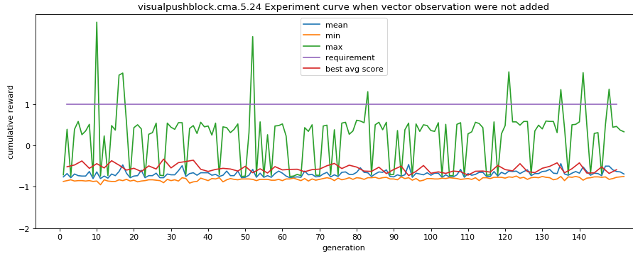
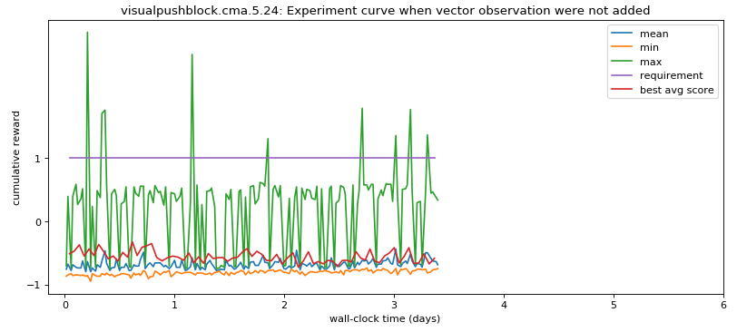
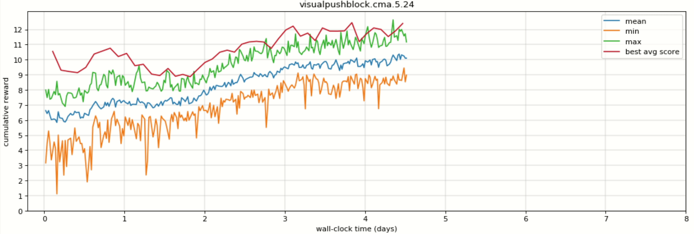
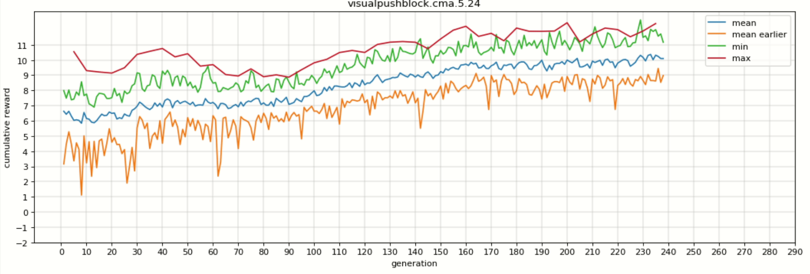

## Worldmodel implementation for Visual PushBlock Unity3d game

### Introduction
[World Model](https://arxiv.org/abs/1803.10122) paper has implemented the “World Model” concept for two games: i) carracing ii) VizDoom of OpenAI gym environment. In my experiment I have applied World model concept for Visual Push Block Unity3D game. Visual PushBlock is significantly different from those two games in that PushBlock game offers sparse reward to the game agent (only at the end after reaching goal) whereas in carracing and VizDoom, the agent is given reward as long as it stays on the road or remain alive. So in my experiment I have shown how to modify Visual pushblock game via extra game parameters and intrinsic motivation (IM) such that agent can learn to solve the game.
Github source of this implementation: https://github.com/Shadek07/WorldModel_VisualPushBlock

### Unity 3d env creation
The first part of this implementation is to create unity3d visual pushblock environment. Tutorial to create environment executable for linux is here: https://github.com/Unity-Technologies/ml-agents/blob/master/docs/Learning-Environment-Executable.md. My blog post regarding one issue of environment executable is here: [Visual Push Block env issue](https://shadekcse.wordpress.com/2019/07/30/how-to-create-visualpushblock-unity-environment-executable-and-interact-with-that-in-python/). Although I initially chose image frame size of 84x84 during env creation, later I changed it to 64x64 to make it same as carracing and Vizdoom implementation used by WorldModel authors. Make sure to copy env data folder (it is also created) along with .x86_64 file in the source code. I have also added two vector observations along with visual observations for 2nd version of policy training: These two observations are: z coordinate of block (if block is pushed towards goal, z coordinate increases), distance between block and agent. Set vector space size of 2 for that. In PushAgentBasics.cs, add the following two lines at the end of CollectObservations function:
```AddVectorObs(blockRB.position.z);
AddVectorObs(Vector3.Distance(agentRB.position, blockRB.position));
```

### Training Data creation
Training data is created by running **extract.py**. I have clipped the value of action from [-1,1] to [-0.5, 0.5] as action values are concentrated on this range. Then dividing this range into 6 equal segments as there are total 6 actions. See the comments in extract.py to find out which segment I have selected for which action.

### VAE training:
For VAE training I have chosen hidden vector (z) size of 64. A blog post on interactive demo of visual pushblock can be found [here](https://shadekcse.wordpress.com/2019/08/20/variational-autoencoder-for-visual-pushblock-unity3d-game/) and [here](https://docs.google.com/document/d/1kkpRZ1UBB_usOmbSq97DjspfE-r8gWlRGLWa07bc-Kc/edit#heading=h.f6qmbi1vk87q).

### MDN-RNN training
It is basically the same as carracing MDN-RNN. Just need to change input dimension that goes into MDN-RNN which is 65 (64 for z size + 1 for action).

### Policy/ Controller training
I first trained Visual PushBlock without two additional vector observations that I mentioned. Without those two observations, agent were not capable enough to solve the game because of sparse reward env. That’s why avg reward curve for 24 agents was almost flat (horizontal line at reward avg of little above -1.0) for 150 generations. In each generation, every agent played 5 episodes of the game. Total number of controller model parameters was 321. The two graphs for this 1st version of controller training are below:


In 2nd version of policy training, we have two extra vector observations mentioned above. In this version I am giving some intrinsic reward to agent. If agent moves one unit closer to block, it will get 0.1 reward and if it moves away from block by 1 unit it will receive 0.01 reward. Same reward structure for the position of block too. If block is pushed 1 unit towards goal, agent will get 0.1. Training is done for 238 generations. What I have seen in this version that, agent is learning to maximize rewards by moving to and moving away from block back and forth. During the training, I have noticed that in most the unity env Agent keeps block in front of it. Average reward for 10 episodes after training is 11.75, but agent was not able to solve game in any of 10 episodes. The corresponding training curve is below. One interesting thing to note that best avg reward is higher than mean reward. This should not be the case. In carracing, best avg is in between mean and max.


